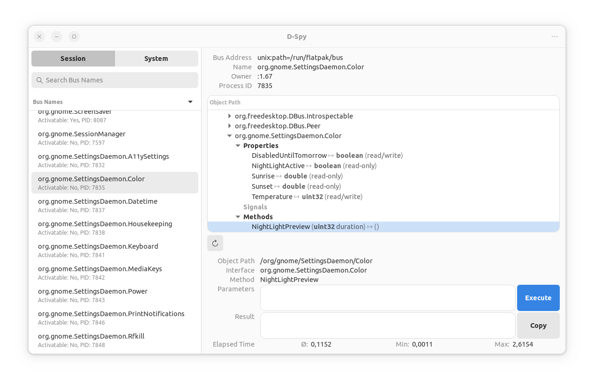

# Rust dbus and dconf gnome api bindings

[](https://crates.io/crates/gnome-dbus-api)
[](https://docs.rs/gnome-dbus-api)
[]()
[]()

A friendly API for interacting with gnome shell, freedesktop and other D-Bus services and settings available on **Ubuntu gnome**.

This project is thought to be used in [Sittly](https://github.com/JulianKominovic/sittly-launcher) a tauri based app, you will see this trending in the examples.

> **Disclaimer**: I'm not a Rust expert, I'm learning Rust and I'm using this project to learn it. If you see something that can be improved, please open an issue or a PR.

## Usage

### System apps

This app struct is thought to be used in a GUI to display all the apps installed in the system.

Because of that app.icon is a png image that can be encoded in base64 using `app.get_base64_icon()` and displayed in a GUI.

```rust
use gnome_dbus_api::handlers::easy_gnome::apps::Apps;

#[derive(Serialize, Deserialize, Clone)]
struct AppStruct {
    name: String,
    icon: Option<String>,
    description: String,
}
// Init gtk global instance to use gtk related functions
// If you already have a gtk instance running you must skip this step
gtk::init().unwrap();

async fn get_all_apps() -> Result<Vec<AppStruct>, String> {
  let apps_instance = Apps::new();
  let apps = apps_instance.get_apps();
  let apps_struct: Vec<AppStruct> = apps
      .iter()
      .map(|app| {
          let base64 = app.get_base64_icon();
          let app_struct = AppStruct {
              name: app.name.to_string(),
              icon: base64,
              description: match &app.description {
                  Some(description) => description.to_string(),
                  None => String::from(""),
              },
          };
          app_struct
      })
      .collect();
  Ok(apps_struct)
}

```

### Screen

```rust
use gnome_dbus_api::handlers::easy_gnome::screen;

async fn brightness_up() -> Result<(), String> {
    screen::step_up().await;
    Ok(())
}
async fn brightness_down() -> Result<(), String> {
    screen::step_down().await;
    Ok(())
}
async fn get_brightness() -> Result<i32, String> {
    let brightness = screen::brightness().await;
    Ok(brightness)
}
async fn set_brightness(value: i32) -> Result<(), String> {
    screen::set_brightness(value).await;
    Ok(())
}
```

### Night light

```rust
use gnome_dbus_api::handlers::easy_gnome::nightlight;

fn get_temperature() {
    let temperature: u32 = nightlight::get_temperature();
}
fn set_temperature() {
    let temperature: u32 = 3000;
    nightlight::set_temperature(temperature);
}

fn reset_temperature() {
    nightlight::reset_temperature();
}
fn set_nightlight_active() {
    let active = true;
    nightlight::set_nightlight_active(active);
}
fn get_nightlight_active() {
   nightlight::get_nightlight_active()
}

```

### Screenshot

```rust
use gnome_dbus_api::handlers::easy_gnome::screenshot;
async fn pick_color() {
  let (r, g, b) = screenshot::pick_color().await;
}
```

### Power

```rust
use gnome_dbus_api::handlers::easy_gnome::power;
async fn power_off() {
power::power_off().await;
}
async fn reboot() {
power::reboot().await;
}
async fn suspend() {
power::suspend().await;
}
```

### Peripherals

```rust
use gnome_dbus_api::handlers::easy_gnome::peripherals;


fn set_keyboard_press_delay() {
    let delay = 100;
    peripherals::set_keyboard_press_delay(delay).unwrap();
    assert_eq!(peripherals::get_keyboard_press_delay().unwrap(), delay);
}

fn reset_keyboard_press_delay() {
    let default_delay = 500;
    peripherals::reset_keyboard_press_delay().unwrap();
    assert_eq!(
        peripherals::get_keyboard_press_delay().unwrap(),
        default_delay
    );
}

fn set_keyboard_repeat_interval() {
    let interval = 100;
    peripherals::set_keyboard_repeat_interval(interval).unwrap();
    assert_eq!(
        peripherals::get_keyboard_repeat_interval().unwrap(),
        interval
    );
}

fn reset_keyboard_repeat_interval() {
    let default_interval = 30;
    peripherals::reset_keyboard_repeat_interval().unwrap();
    assert_eq!(
        peripherals::get_keyboard_repeat_interval().unwrap(),
        default_interval
    );
}

fn set_mouse_natural_scroll() {
    peripherals::set_mouse_natural_scroll(true).unwrap();
    assert_eq!(peripherals::get_mouse_natural_scroll().unwrap(), true);
}

fn reset_mouse_natural_scroll() {
    peripherals::reset_mouse_natural_scroll().unwrap();
    assert_eq!(peripherals::get_mouse_natural_scroll().unwrap(), false);
}

fn set_touchpad_tap_to_click() {
    peripherals::set_touchpad_tap_to_click(false).unwrap();
    assert_eq!(peripherals::get_touchpad_tap_to_click().unwrap(), false);
}

fn reset_touchpad_tap_to_click() {
    peripherals::reset_touchpad_tap_to_click().unwrap();
    assert_eq!(peripherals::get_touchpad_tap_to_click().unwrap(), false);
}

fn set_two_finger_scroll() {
    peripherals::set_two_finger_scroll(false).unwrap();
    assert_eq!(peripherals::get_two_finger_scroll().unwrap(), false);
}

fn reset_two_finger_scroll() {
    peripherals::reset_two_finger_scroll().unwrap();
    assert_eq!(peripherals::get_two_finger_scroll().unwrap(), true);
}
```

### Battery

```rust
use gnome_dbus_api::handlers::easy_gnome::battery;

async fn get_battery_display() {
    let battery_display = battery::get_current_device_battery().await.unwrap();

    let full_design_battery = battery_display.energy_full_design().await.unwrap();
    let full_battery = battery_display.energy_full().await.unwrap();
    let current_battery = battery_display.energy().await.unwrap();
    let percentage = battery_display.percentage().await.unwrap();
    let battery_state = battery_display.state().await.unwrap();
    let temperature = battery_display.temperature().await.unwrap();
    let is_rechargable = battery_display.is_rechargeable().await.unwrap();
    let model = battery_display.model().await.unwrap();
    let vendor = battery_display.vendor().await.unwrap();
    let power_supply = battery_display.power_supply().await.unwrap();
    let battery_type = battery_display.type_().await.unwrap();
}

async fn get_devices_battery() {
    let battery_devices = battery::get_devices_battery().await.unwrap();

    for device in battery_devices {
        let full_design_battery = device.energy_full_design().await.unwrap();
        let full_battery = device.energy_full().await.unwrap();
        let current_battery = device.energy().await.unwrap();
        let percentage = device.percentage().await.unwrap();
        let battery_state = device.state().await.unwrap();
        let temperature = device.temperature().await.unwrap();
        let is_rechargable = device.is_rechargeable().await.unwrap();
        let model = device.model().await.unwrap();
        let vendor = device.vendor().await.unwrap();
        let power_supply = device.power_supply().await.unwrap();
        let battery_type = device.type_().await.unwrap();

        println!(
            "full_design_battery: {} full_battery: {} current_battery: {} percentage: {} battery_state: {:?} temperature: {} is_rechargable: {} model: {} vendor: {} power_supply: {} battery_type: {:?}",
            full_design_battery, full_battery, current_battery, percentage, battery_state, temperature, is_rechargable, model, vendor, power_supply,battery_type
        );
    }
}
```

### Gnome extensions

```rust
use gnome_dbus_api::handlers::easy_gnome::extensions;

async fn get_extensions() {
    let extensions = extensions::get_extensions().await;
    assert!(extensions.len() > 0);
    println!("{:?}", extensions);
}

async fn launch_extension_preferences() {
    let _extensions_list = extensions::get_extensions().await;
    // You can get the extension uuid from the extensions::get_extensions() function
    let extension_uuid = "ubuntu-appindicators@ubuntu.com";
    extensions::open_extension_preferences(extension_uuid).await
}

async fn disable_extension() {
    let _extensions_list = extensions::get_extensions().await;
    // You can get the extension uuid from the extensions::get_extensions() function
    let extension_uuid = "extension-list@tu.berry";
    extensions::disable_extension(extension_uuid).await
}

async fn enable_extension() {
    let _extensions_list = extensions::get_extensions().await;
    // You can get the extension uuid from the extensions::get_extensions() function
    let extension_uuid = "extension-list@tu.berry";
    extensions::enable_extension(extension_uuid).await
}

async fn uninstall_extension() {
    let _extensions_list = extensions::get_extensions().await;
    // You can get the extension uuid from the extensions::get_extensions() function
    let extension_uuid = "extension-list@tu.berry";
    extensions::uninstall_extension(extension_uuid).await
}
```

## Features

- [x] Power management
  - [x] Power off
  - [x] Reboot
  - [x] Suspend
- [x] Locales
  - [x] Get x11 layout
- [x] Gnome extensions
  - [x] Get extensions
  - [x] Enable extension
  - [x] Disable extension
  - [x] Uninstall extension
- [x] Gnome shell screenshot
  - [x] Pick color
- [x] Settings

  - [x] Night light
    - [x] Get night light status
    - [x] Set night light status
    - [x] Get night light temperature
    - [x] Set night light temperature

- [ ] Gsettings Dconf (https://crates.io/crates/dconf_rs/0.3.0)
  - [ ] 
  - [x] org.gnome.desktop.peripherals.touchpad two-finger-scrolling-enabled true
  - [x] org.gnome.desktop.peripherals.touchpad tap-to-click true
  - [x] org.gnome.desktop.peripherals.mouse natural-scroll true
  - [x] org.gnome.desktop.peripherals.keyboard repeat-interval 30 (initial key repeat delay)
  - [x] org.gnome.desktop.peripherals.keyboard delay 500 (initial key repeat delay)
  - [x] org.gnome.desktop.interface show-battery-percentage true
  <!-- - [ ] org.gnome.desktop.interface overlay-scrolling true -->
  - [x] org.gnome.desktop.interface locate-pointer false (with ctrl key)
  <!-- - [ ] org.gnome.desktop.interface enable-hot-corners false -->
  - [x] org.gnome.desktop.interface cursor-size 24
      <!-- - [ ] org.gnome.desktop.interface cursor-blink-timeout 10 -->
      <!-- - [ ] org.gnome.desktop.interface cursor-blink-time 1200 -->
      <!-- - [ ] org.gnome.desktop.interface cursor-blink true -->
    <!-- - [ ] org.gnome.desktop.interface color-scheme 'prefer-light' -->
    <!-- - [ ] org.gnome.desktop.interface clock-show-weekday true
  - [ ] org.gnome.desktop.interface clock-show-seconds false
  - [ ] org.gnome.desktop.interface clock-show-date true
  - [ ] org.gnome.desktop.interface clock-format -->
  - [x] org.gnome.shell disable-user-extensions false
  - [ ] org.gnome.shell development-tools true
  - [ ] org.gnome.mutter center-new-windows
  - [ ] org.gnome.gnome-session auto-save-session false (restore open apps on login)
  - [ ] org.gnome.desktop.screensaver picture-uri 'file:///home/julian/...'
  - [ ] org.gnome.desktop.privacy hide-identity false
  - [ ] org.gnome.desktop.privacy disable-sound-output false
  - [ ] org.gnome.desktop.privacy disable-microphone false
  - [ ] org.gnome.desktop.privacy disable-camera false
  - [ ] org.gnome.desktop.calendar show-weekdate
  - [ ] org.gnome.desktop.background show-desktop-icons true
  - [ ] org.gnome.desktop.background picture-uri-dark 'file:///home/julian/Pictures/Wallpapers/image.webp'
  - [ ] org.gnome.desktop.a11y.applications screen-reader-enabled false
  - [ ] org.gnome.desktop.a11y.applications screen-magnifier-enabled false
  - [ ] org.gnome.desktop.a11y.applications screen-keyboard-enabled false
  - [ ] org.gnome.desktop.a11y always-show-universal-access-status false
  - [ ] org.gnome.desktop.a11y always-show-text-caret false
  - [ ] **org.gnome.shell.extensions.dash-to-dock > XYZ**

## Interfaces

- [ ] org.freedesktop.UPower: (https://crates.io/crates/upower_dbus)
  - [ ] is_on_battery
  - [ ] is_lid_closed
  - [ ] enumerate_devices
  - [ ] get_display_device
  - [x] device, battery, external_device
    - [x] type (important to identify external devices) (https://upower.freedesktop.org/docs/Device.html)
    - [x] state (https://upower.freedesktop.org/docs/Device.html)
    - [x] technology (https://upower.freedesktop.org/docs/Device.html)
    - [x] get_percentage
    - [x] time_to_empty (seconds) (0 if unknown)
    - [x] time_to_full (seconds) (0 if unknown)
    - [x] capacity (battery life)
    - [x] energy_full (Wh) (actual max charge)
    - [x] energy_full_design (Wh) (factory max charge)
    - [x] energy_rate (W) (current power draw)
    - [x] temperature (K)
    - [x] model
    - [x] vendor
    - [x] voltage
- [x] net.hadess.PowerProfiles: power profiles (power save, balanced, performance)

  - [x] active_profile (read/write)
  - [ ] PerformanceInhibited (read) (reason for performance being inhibited)
  - [ ] PerformanceDegraded (read) (reason for performance being degraded)

- org.bluez: bluetooth devices, devices stats
- org.freedesktop.NetworkManager: network manager, wifi, connections
- org.freedesktop.UDisks2: disks, partitions, filesystems
- org.freedesktop.FileManager1: file manager (nautilus)
- org.gnome.SettingsDaemon.\*: settings daemon
  - [ ] org.gnome.SettingsDaemon.Power:
    - [ ] keyboard
      - [ ] brightness (r/w)
      - [ ] brightness-step-up
      - [ ] brightness-step-down
      - [ ] brightness-toggle

## Gnome shell

- [Gnome shell get all apps](https://github.com/GNOME/gnome-shell/blob/main/src/shell-app-cache.c#L342)

## Devtools

- [D-Spy](https://flathub.org/apps/org.gnome.dspy): search for and inspect D-Bus services  
  

## Dbus sources

- [What is DBUS? Use cases](https://www.baeldung.com/linux/dbus)
- [DBUS data types](https://www.alteeve.com/w/List_of_DBus_data_types)
- [CLI DBUS man pages](https://sarata.com/manpages/dbus-send.1.html)
- [DBUS Gnome shell interfaces](https://gitlab.gnome.org/GNOME/gnome-shell/-/tree/92d3c6e051958b31151bf9538205a71cab6f70d7/data/dbus-interfaces)

## GSettings

[Gnome mutter schema](https://github.com/GNOME/mutter/blob/main/data/org.gnome.mutter.gschema.xml.in)

## Rust bindings

- [zbus](https://dbus2.github.io/zbus/introduction.html) a beatifully designed abstraction over D-Bus
- [zvariant](https://docs.rs/zvariant/latest/zvariant/) a crate for working with D-Bus types
